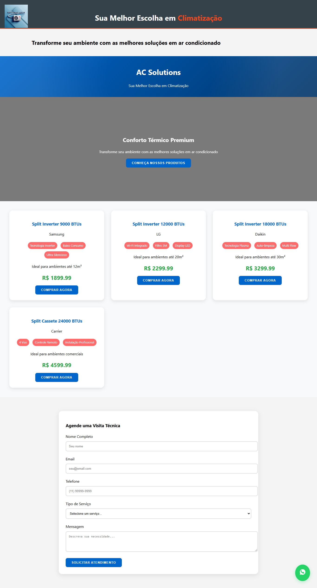

# pagina-de-ar-codicionado

O código da página de vendas da AC Solutions é uma aplicação web completa e bem estruturada para uma empresa de vendas e manutenção de ar condicionado. Vou explicar os principais componentes e funcionalidades:

## Estrutura HTML

O arquivo HTML contém a estrutura básica da página, incluindo:

1. Um cabeçalho com o nome da empresa e slogan
2. Uma seção hero com uma imagem de fundo e chamada para ação
3. Uma seção de produtos
4. Um formulário para agendamento de visitas técnicas
5. Um botão fixo de WhatsApp para contato rápido

## Estilização CSS

O CSS está incorporado no arquivo HTML e fornece um design moderno e responsivo:

1. Utiliza gradientes e animações para criar um cabeçalho atraente
2. Define um layout em grid para a exibição dos produtos
3. Estiliza os cartões de produto com efeitos de hover
4. Cria um formulário de contato bem formatado
5. Inclui um botão de WhatsApp flutuante com ícone SVG
6. Implementa design responsivo para dispositivos móveis

## Funcionalidades JavaScript

O JavaScript no final do arquivo adiciona interatividade à página:

1. Define um array de produtos com suas características
2. Renderiza dinamicamente os cartões de produto na página
3. Implementa uma função de rolagem suave para a seção de produtos
4. Gerencia o envio do formulário de agendamento, incluindo validação e feedback ao usuário
5. Cria uma função para direcionar o usuário ao WhatsApp ao clicar em "Comprar Agora"

## Características Notáveis

1. Design atraente e profissional com gradientes e animações
2. Responsividade para diferentes tamanhos de tela
3. Integração com WhatsApp para facilitar o contato com clientes
4. Apresentação clara dos produtos com destaque para características principais
5. Formulário de agendamento para captura de leads

Esta página de vendas oferece uma experiência de usuário completa, desde a apresentação dos produtos até a facilitação do contato com a empresa, tudo em uma única página bem estruturada e esteticamente agradável.

